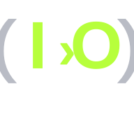
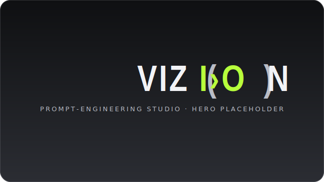

<div align="center">



# VIZ(IO)N

**A VASEY/AI prompt-engineering studio — mobile-first PWA.**

_Clarify · Expand · Condense · Reformat · Re-target — the same idea, fitted to the engine that's about to receive it._

[](https://github.com/SeanVasey/vizion/actions)
[](https://nextjs.org)
[](https://react.dev)
[](https://www.typescriptlang.org)
[](https://web.dev/progressive-web-apps/)
[](./LICENSE)

</div>

> **Successor to rePROMPTer 2.** Where rePROMPTer _upgraded_ a prompt, VIZ(IO)N
> _transforms_ it — across three target models (Opus 4.8 · GPT-5.5 · Gemini Pro 3.1),
> five enhancement modes, and media-aware prompt construction, with accounts and a
> versioned prompt library.

<div align="center">

<!-- Hero screenshot placeholder — replace with a real capture once P1 ships to preview. -->


</div>

## Architecture

```
Client (PWA, Next.js 15 · React 19)
  ├─ App shell (Workbox precache) · Zustand (UI) · TanStack Query (server state)
  ├─ Routes: /enhance  /library  /profile  /(auth)
  └─ Service worker: SWR(shell) · network-first(enhance, auth) · cache-fallback(library)
        │  HTTPS — no model keys client-side
        ▼
Next Route Handlers (Edge) ── Provider Adapter ──┬─ Anthropic (opus_4_8)
  ├─ /api/enhance   (mode + target → formatter)  ├─ OpenAI    (gpt_5_5)
  ├─ /api/media     (extract → attributes)        └─ Google    (gemini_pro_3_1)
  └─ per-user rate limit + cost cap + audit log
        │
        ▼
Supabase ── Postgres (RLS) · Auth (magic link · GitHub · Google) · Storage (avatars, media)
```

See [`docs/architecture.md`](./docs/architecture.md) and the locked decision log in
[`docs/decisions/`](./docs/decisions).

## Status

| Phase                     | Scope                                                     | State          |
| ------------------------- | --------------------------------------------------------- | -------------- |
| **v0.1 — Shell**          | Tokens · manifest · Workbox SW · safe-area · nav · themes | 🟢 done        |
| **v0.2 — Auth & profile** | Supabase Auth · RLS · avatar crop · onboarding            | 🟢 done        |
| **v0.3 — Enhance core**   | Provider adapter · 5 modes · transformation diff · caps   | 🟢 in progress |
| v0.4 — Library            | Save · immutable versions · diff/restore · activity feed  | ⚪ planned     |
| v0.5 — Media prompts      | Attach media · extraction · generation-syntax formatters  | ⚪ planned     |
| v1.0 — Hardening          | Rate limits · eviction recovery · WCAG AA                 | ⚪ planned     |

## Getting started

```bash
npm install
cp .env.example .env.local      # fill in when wiring P2+ (no secrets committed)
npm run generate:icons          # produce the transparent-PNG icon + splash matrix
npm run dev                     # http://localhost:3000
```

### Verification gate (run before every commit)

```bash
npm run lint && npm run typecheck && npm run test && npm run test:e2e && npm run build
```

## Tech stack

Next.js 15 (App Router) · React 19 · TypeScript · Tailwind + CSS-var tokens ·
TanStack Query · Zustand · Workbox · Supabase (Postgres + RLS, Auth, Storage) ·
Inngest (async, P5+) · Vercel.

## Brand

VIZ(IO)N is a **VASEY/AI** product. No association with VASEY.AUDIO.

## License

[MIT](./LICENSE) © VASEY/AI
