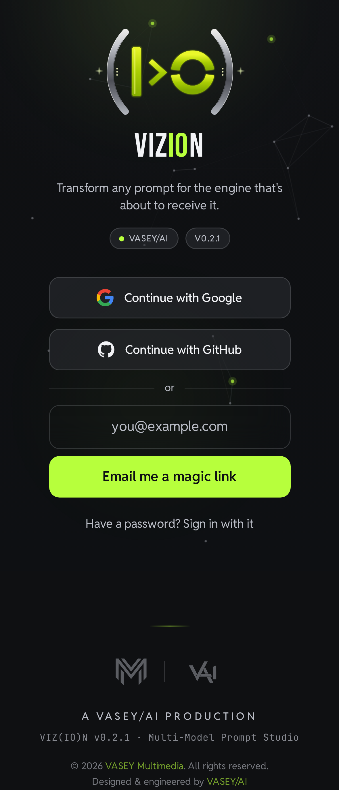

<div align="center">


# VIZ(IO)N

**A VASEY/AI prompt-engineering studio — mobile-first PWA.**

_Clarify · Polish · Expand · Condense · Reformat · Re-target — the same idea, fitted to the engine that's about to receive it._

[](https://github.com/SeanVasey/vizion/actions)
[](https://nextjs.org)
[](https://react.dev)
[](https://www.typescriptlang.org)
[](https://web.dev/progressive-web-apps/)
[](./LICENSE)

</div>

> **Successor to rePROMPTer 2.** Where rePROMPTer _upgraded_ a prompt, VIZ(IO)N
> _transforms_ it — across five target models (Opus 4.8 · GPT-5.6 Sol · Fable 5 ·
> Gemini 3.5 Flash · Grok 4.5), six enhancement modes, and media-aware prompt
> construction, with accounts and a versioned prompt library.

<div align="center">

<!-- Live capture of the shipped sign-in gate (v0.2.0), rendered from the production build. -->


</div>

## Architecture

```
Client (PWA, Next.js 15 · React 19)
  ├─ App shell (Workbox precache) · Zustand (UI) · TanStack Query (server state)
  ├─ Routes: /enhance  /library  /profile  /(auth)
  └─ Service worker: SWR(shell) · network-first(enhance, auth) · cache-fallback(library)
        │  HTTPS — no model keys client-side
        ▼
Next Route Handlers (Edge) ── Provider Adapter ──┬─ Anthropic (opus_4_8 · fable_5)
  ├─ /api/enhance   (mode + target → formatter)  ├─ OpenAI    (gpt_5_6_sol)
  ├─ /api/media     (extract → attributes)        ├─ Google    (gemini_3_5_thinking)
  └─ per-user rate limit + cost cap + audit log   └─ xAI       (grok_4_5)
        │
        ▼
Supabase ── Postgres (RLS) · Auth (magic link · GitHub · Google) · Storage (avatars, media)
```

See [`docs/architecture.md`](./docs/architecture.md) and the locked decision log in
[`docs/decisions/`](./docs/decisions).

## Status

| Phase                     | Scope                                                     | State          |
| ------------------------- | --------------------------------------------------------- | -------------- |
| **v0.1 — Shell**          | Tokens · manifest · Workbox SW · safe-area · nav · themes | 🟢 done        |
| **v0.2 — Auth & profile** | Supabase Auth · RLS · avatar crop · onboarding            | 🟢 done        |
| **v0.3 — Enhance core**   | Provider adapter · 6 modes · transformation diff · caps   | 🟢 done        |
| **v0.4 — Library**        | Save · immutable versions · diff/restore · activity feed  | 🟢 done        |
| **v0.5 — Media prompts**  | Attach media · extraction · generation-syntax formatters  | 🟢 done        |
| **v1.0 — Hardening**      | CSP · rate limits · eviction outbox · a11y · checklist    | 🟢 in progress |

## Getting started

```bash
npm install
cp .env.example .env.local      # fill in when wiring P2+ (no secrets committed)
npm run generate:icons          # produce the transparent-PNG icon + splash matrix
npm run dev                     # http://localhost:3000
```

### Verification gate (run before every commit)

```bash
npm run lint && npm run typecheck && npm run test && npm run test:e2e && npm run build
```

## Versioning & releases

Semantic Versioning, single-sourced from `package.json` (surfaced in the UI via
`NEXT_PUBLIC_APP_VERSION`) and documented in [`CHANGELOG.md`](./CHANGELOG.md)
(Keep a Changelog). Merging a version bump to `main` makes
[`release.yml`](./.github/workflows/release.yml) tag `v<version>` and publish a
GitHub Release with the matching changelog section as notes. Full procedure:
[`docs/runbooks/release.md`](./docs/runbooks/release.md).

## Tech stack

Next.js 15 (App Router) · React 19 · TypeScript · Tailwind + CSS-var tokens ·
TanStack Query · Zustand · Workbox · Supabase (Postgres + RLS, Auth, Storage) ·
Inngest (async, P5+) · Vercel.

## Brand

VIZ(IO)N is a **VASEY/AI** product. No association with VASEY.AUDIO.

The identity is the **aperture glyph** — a neon-lime bar, chevron and split ring
framed by two chrome parentheses — shown two ways:

- **App icon** (`public/brand/vizion-icon-token.svg`) — the glyph on a glossy black
  squircle with a lime-green glowing border. Drives the opaque surfaces: the iOS
  Add-to-Home-Screen tile (`apple-touch-icon`), the favicons, and the App Router
  `icon`/`apple-icon`.
- **Glyph** (`public/brand/vizion-mark-token.svg`) — the same mark alone on a
  transparent ground. Drives the transparent `any` PWA icon matrix, the maskable
  safe-zone tiles, and the iOS splash glyph.

These two SVGs are the single source of truth; `npm run generate:icons` re-derives the
entire 32-file icon + splash matrix from them via `sharp`. Don't hand-edit the PNGs.

## License

[MIT](./LICENSE) © VASEY/AI
