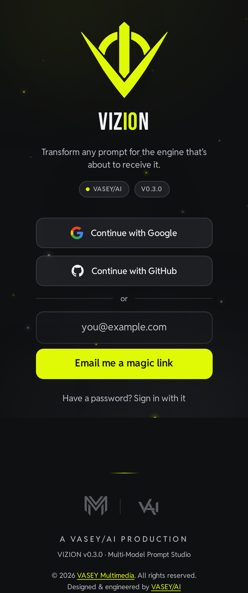
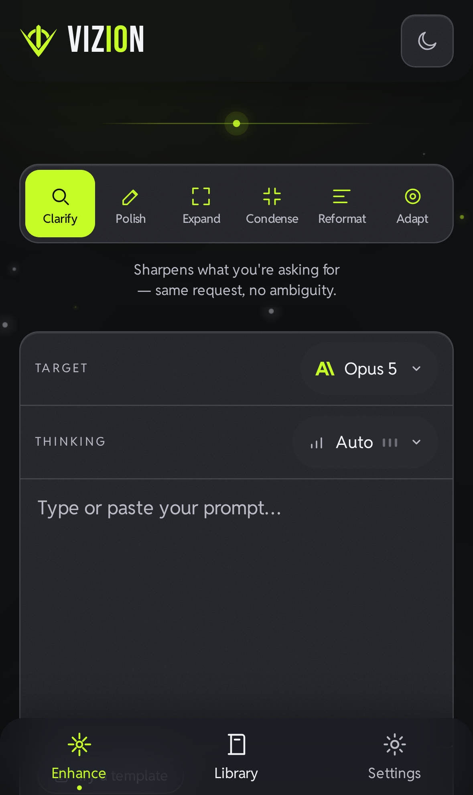
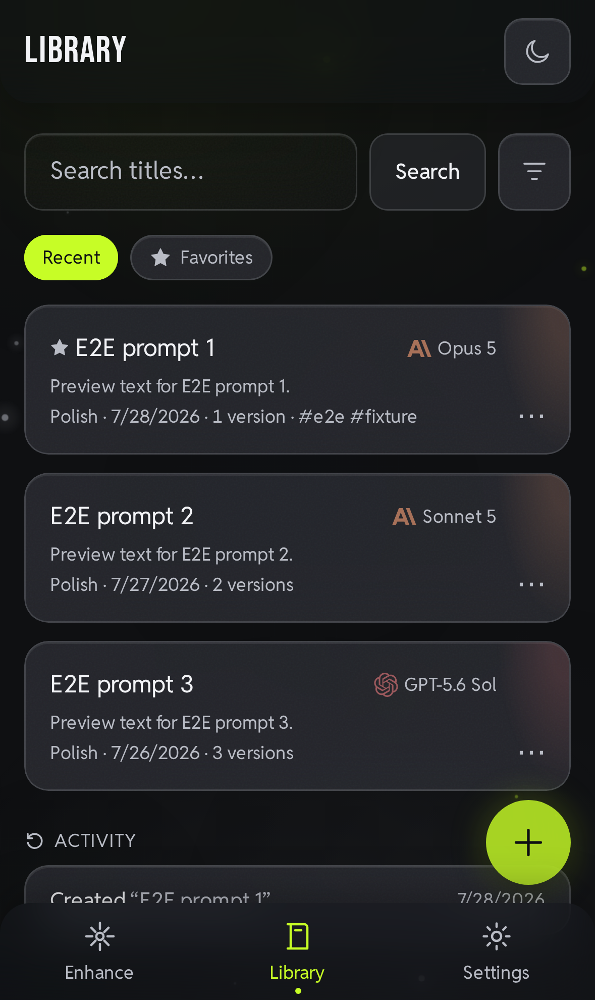

<div align="center">


# VIZION

**A VASEY/AI prompt-engineering studio — mobile-first PWA.**

_Clarify · Polish · Expand · Condense · Reformat · Adapt — the same idea, fitted to the engine that's about to receive it._

[](https://github.com/SeanVasey/vizion/actions)
[](https://nextjs.org)
[](https://react.dev)
[](https://www.typescriptlang.org)
[](https://web.dev/progressive-web-apps/)
[](./LICENSE)

</div>

> **Successor to rePROMPTer 2.** Where rePROMPTer _upgraded_ a prompt, VIZION
> _transforms_ it — across sixteen target models from twelve developers
> (Fable 5 · Opus 5 · Sonnet 5 · GPT-5.6 Sol/Terra/Luna · DeepSeek V4 ·
> Gemini 3.6 Flash · Muse Spark 1.1 · MiniMax M3 · Mistral Large 3 · Kimi K3 ·
> Sonar Pro · Qwen3.8 Max · Grok 4.5 · GLM-5.2), a per-model thinking-depth
> selector, six enhancement modes, and media-aware
> prompt construction, with accounts and a versioned prompt library.

<div align="center">

<!-- Live captures of the shipped app, rendered from the production build
     (CAPTURE=1 npx playwright test capture.spec.ts --project=mobile-chrome). -->


<br /><br />


&nbsp;&nbsp;


</div>

## Architecture

```
Client (PWA, Next.js 15 · React 19)
  ├─ App shell (Workbox precache) · Zustand (UI) · TanStack Query (server state)
  ├─ Routes: /enhance  /library  /profile  /(auth)
  └─ Service worker: SWR(same-origin static assets) · NetworkOnly navigations → offline.html
        │  HTTPS — no model keys client-side
        ▼
Next Route Handlers (Node) ── Provider Adapter ──┬─ Anthropic  (fable_5 · opus_5 · sonnet_5)
  ├─ /api/enhance   (mode + target → formatter)  ├─ OpenAI     (gpt_5_6_sol · gpt_5_6_luna · gpt_5_6_terra)
  ├─ /api/media     (extract → attributes)        ├─ Google     (gemini_3_6_flash)
  └─ per-user rate limit + cost cap + audit log   ├─ Mistral    (mistral_large_3)
                                                  ├─ xAI        (grok_4_5)
                                                  └─ OpenAI-compatible proxy:
                                                     DeepSeek (deepseek_v4) · Meta (muse_spark_1_1)
                                                     MiniMax (minimax_m3) · Moonshot (kimi_k3)
                                                     Perplexity (sonar_pro) · Qwen (qwen3_8_max)
                                                     Z.ai (glm_5_2)
        │
        ▼
Supabase ── Postgres (RLS) · Auth (magic link · GitHub · Google) · Storage (avatars, media)
```

See [`docs/architecture.md`](./docs/architecture.md) and the locked decision log in
[`docs/decisions/`](./docs/decisions).

## Status

| Phase              | Scope                                                     | State   |
| ------------------ | --------------------------------------------------------- | ------- |
| **Shell**          | Tokens · manifest · Workbox SW · safe-area · nav · themes | 🟢 done |
| **Auth & profile** | Supabase Auth · RLS · avatar crop · onboarding            | 🟢 done |
| **Enhance core**   | Provider adapter · 6 modes · transformation diff · caps   | 🟢 done |
| **Library**        | Save · immutable versions · diff/restore · activity feed  | 🟢 done |
| **Media prompts**  | Attach media · extraction · generation-syntax formatters  | 🟢 done |
| **Hardening**      | CSP · rate limits · eviction outbox · a11y · checklist    | 🟢 done |

## Getting started

```bash
npm install
cp .env.example .env.local      # fill in to enable Supabase + providers (no secrets committed)
npm run generate:icons          # produce the transparent-PNG icon + splash matrix
npm run dev                     # http://localhost:3000
```

### Verification gate (run before every commit)

```bash
npm run lint && npm run typecheck && npm run test && npm run test:e2e && npm run build
```

## Versioning & releases

Semantic Versioning, single-sourced from `package.json` (surfaced in the UI via
`NEXT_PUBLIC_APP_VERSION`) and documented in [`CHANGELOG.md`](./CHANGELOG.md)
(Keep a Changelog). Merging a version bump to `main` makes
[`release.yml`](./.github/workflows/release.yml) tag `v<version>` and publish a
GitHub Release with the matching changelog section as notes. Full procedure:
[`docs/runbooks/release.md`](./docs/runbooks/release.md).

## Tech stack

Next.js 15 (App Router) · React 19 · TypeScript · Tailwind + CSS-var tokens ·
TanStack Query · Zustand · Workbox · Supabase (Postgres + RLS, Auth, Storage) ·
Vercel.

## Brand

VIZION is a **VASEY/AI** product. No association with VASEY.AUDIO.

The identity is the **VIZION mark** — a chevron framing a bar and split ring —
shipped as an iOS 26 Liquid Glass icon set under `public/brand/`.

**`public/brand/vizion-glyph.svg` is the single raster source of truth**: the
mark alone, flat, on a tight 1024 × 892.8 viewBox. `npm run generate:icons`
composes the entire 32-file icon + splash matrix from it via `sharp`, painting
it with the locked colorways it reads from `tokens.css` — `Laser #C7FD26`,
`Void #0F1012`. Don't hand-edit the PNGs, and don't edit `public/brand/` to
change a derivative.

The colorways are:

- **Outlined** (Laser plate · Laser-filled mark · Void outline · a slight top-lit
  gradient on both) — **everything a launcher installs**: the Add-to-Home-Screen
  tile (`apple-touch-icon.png`), the maskable tiles, the transparent `any`
  matrix (the outlined mark alone, no plate) and the scalable `app-icon.svg`.
- **Light** (Laser plate + Void ink, flat) — the house colorway for the raster
  favicons plus `favicon.ico`, and the square `og:image` share tile.
- **Dark** (Void plate + Laser glyph, flat) — the iOS splash screens (matching
  the manifest's `background_color`).

**The installed icon is outlined so that no treatment of its plate can hide
it** ([ADR-0017](./docs/decisions/0017-outlined-home-screen-icon.md)). Device
passes (2026-08-12 and -13) established that iOS reads `apple-touch-icon` from
the head, does **not** evaluate `media` on icons, **freezes** the tile at
capture, and auto-darkens the frozen tile under dark appearance. Each flat
colorway is legible on exactly one ground — Void ink on a Laser plate vanished
when iOS crushed the plate toward the ink, and the dark tile that replaced it
([ADR-0015](./docs/decisions/0015-pinned-home-screen-tile.md)) survived every
treatment only by keeping the brand green off the Home Screen. The outlined mark
carries its own contrast instead: on the Laser plate the Void outline reads; on
a plate an OS has darkened or replaced, the Laser fill reads. Measured on
device (2026-09-04): in dark appearance iOS swaps the plate for a dark gradient
and keeps the outlined mark pixel for pixel; in light it shows the tile as
authored. The runbook carries the samples.

The **arrangement** ADR-0015 settled is unchanged: `metadata.icons.apple` holds
one unconditional link, at `/icons/apple-touch-icon.png`. **Do not add a second
`apple-touch-icon` link, a `media` query, or a JS matcher.** Each has shipped
here, and each shipped the invisible mark: a `media` pair (#108), that pair
reordered plus a client-side matcher (#111), and a self-inverting SVG as a Home
Screen route (#111). Every one bet that iOS would re-resolve or select
something; it does not.

`/icons/app-icon.svg` is the outlined tile as vector, in **one** colorway — the
`prefers-color-scheme` swap it used to carry existed only to keep the mark
legible on whichever plate the appearance chose, and the outline makes that
moot.

See [the iOS runbook](./docs/runbooks/ios-verification.md) for the measured
result table and the superseded arrangements.

There are no `src/app/icon*`/`apple-icon` convention files. Declaring
`metadata.icons` at all suppresses the convention links — it is an
all-or-nothing merge — so `layout.tsx` declares the whole icon head and every
file lives under `public/icons/`.

**Share artwork** (`npm run generate:social`, also token-driven) is the one
other pair of generated files:

- `og-tile.png` — 1200 × 1200, the Light appearance at share resolution. This is
  `og:image`, and it is square because every consumer of `og:image` except X
  crops toward a square: iOS Safari's Share Sheet takes the centre 640 × 640,
  which of a landscape card kept one arm of the chevron and half a sentence.
- `social-card.png` — 1280 × 640, the descriptive card. Now `twitter:image`
  only (X reads it first and genuinely wants 2:1), plus the artwork for
  GitHub → Settings → General → Social preview.

The rest of `public/brand/` is reference, not raster input, and all of it belongs
to the current identity — the retired I›O `*-token.svg` pair is gone.

- **Composed previews** (`vizion-icon-{light,dark,clear,tinted}.svg`) and
  **background layers** (`vizion-icon-bg-*.svg`) carry a baked squircle clip and
  specular gloss: they show how the icon _appears_ once iOS has masked and
  glassified it. Rasterizing them would bake in the corners and gloss the OS
  applies at runtime, so the generator never reads them.
- **Foreground layers** (`vizion-icon-foreground-{lime,ink,mono}.svg`) are the
  Icon Composer stack, the source set for a native `.icon` build.
  `foreground-lime.svg` also serves as evidence: it carries
  `translate(133.12, 165.66) scale(0.74)`, which the generator reproduces to
  0.03 px — the check that the composed plates really are the shipped artwork.

**In the app, no `public/brand/` file is rendered at all.** Both brand surfaces —
the `ScreenHeader` mark and the sign-in hero — use `BrandMark`: the master glyph
inlined as a single path on `currentColor`, paired with `text-accent` so it
follows the theme. Never a hardcoded fill; brand Laser as ink on the light
canvas is a 1.09:1 contrast FAIL. `tests/unit/brand-mark.test.ts` keeps the
inlined geometry equal to the master.

The header used to serve the composed `vizion-icon-light.svg` as a plated tile.
It no longer does, because that plate is a _gradient_
(`#ECFF52 → #DFFA04 → #C2E000`): almost none of its area is the accent, so it
measured `#C9E601`–`#D3EF02` beside a wordmark reading a flat `--accent-ink` and
the two greens visibly disagreed. On `currentColor` the mark and the wordmark
are the same token by construction and cannot drift apart.

The brand green is `--laser`, and the **token leads**. It was retuned `#B7FF3C`
→ `#DFFA04` to meet the Liquid Glass set, then pulled back off yellow to
`#C7FD26` (hue ~75°) when the `#DFFA04` set read too yellow beside the neon
buttons — see [ADR-0013](./docs/decisions/0013-brand-green-retune.md) and its
2026-08-11 amendment. The generator closes the loop: it reads `--laser` and
`--void` out of `tokens.css` rather than restating them, so every generated icon
follows the token by construction. The Liquid Glass **source** SVGs in
`public/brand/` still carry `#DFFA04` — they are Icon Composer artwork for a
future native `.icon` build, never rasterized into the PWA, so their green is
independent of the shipped token until that art is re-exported.

## License

[MIT](./LICENSE) © 2026 Sean Vasey (VASEY/AI). Vendored fonts under
`src/app/fonts/` are licensed separately under the [SIL Open Font License
1.1](./src/app/fonts/OFL.txt).
